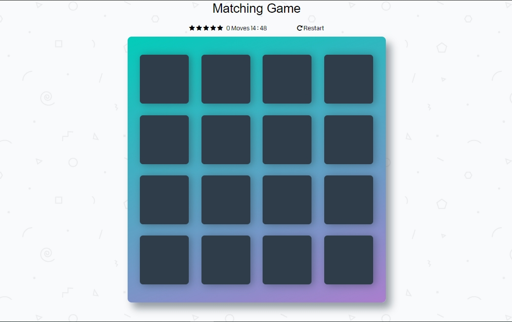
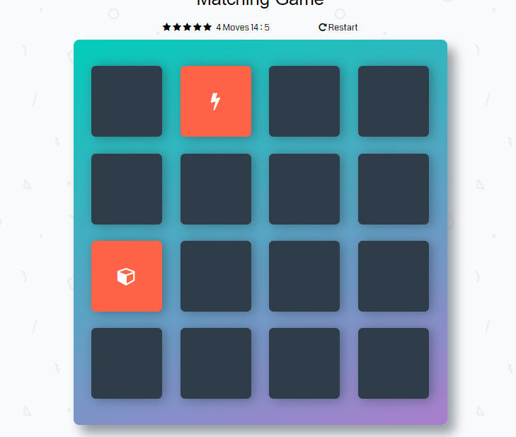
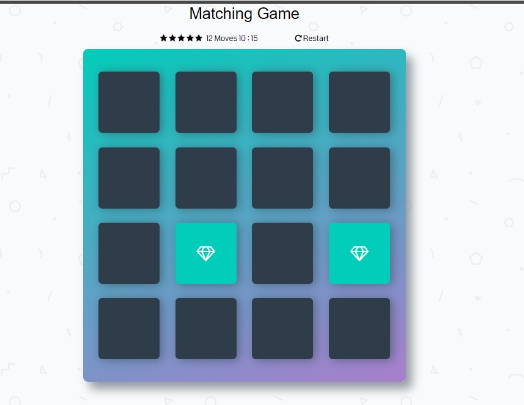
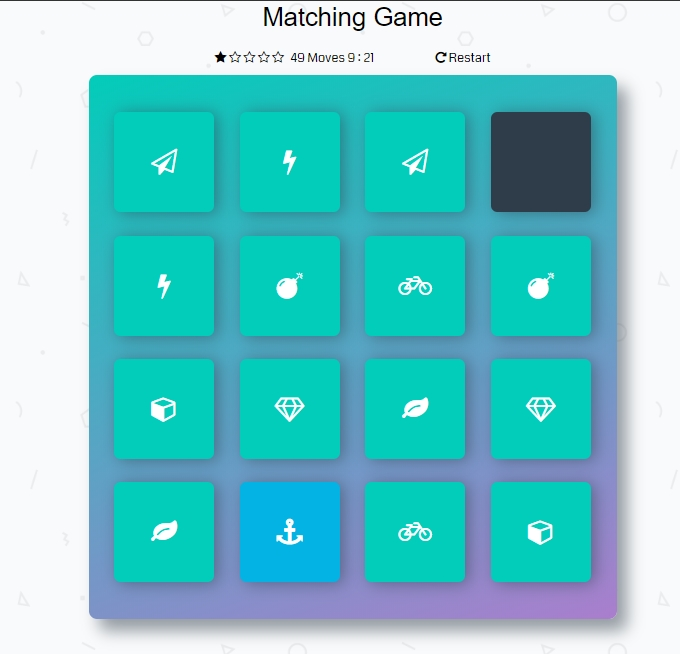
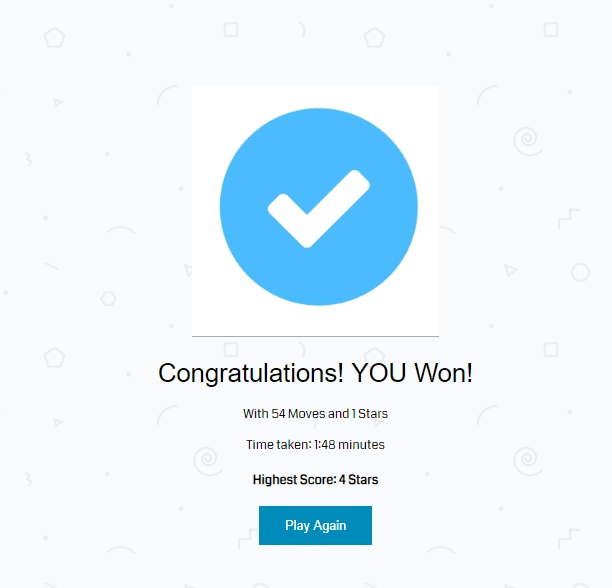

# Memory Game Project

## Overview 

Memory game also known as (concentration) is a card game in which all of the cards are laid face down and two cards are flipped face up over each turn.
The object of the game is to turn over pairs of matching cards.

## Instructions

* Turn over any two cards.
* If the two cards match, they'll stay turned over.
* If they don't match, they'll turn back over.
* Remember what was on each card and where it was.
* The game is over when all the cards have been matched.

## Screenshots

## Technical Notes

-Use Events, Events handler to control the click of the cards.

-Use browser Local storage to track the player's highest score.

-Use SetInterval to track the player's timer and calculate the time taken to win.

## Note

this project is a part of the udacity Front-End web development Nanodegree program.
